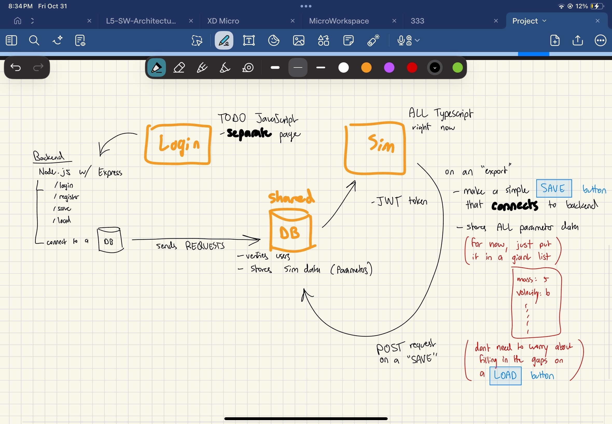

# Collision-Simulator

## Website Description
A 2D multi-vehicle collision simulator. This website is meant for students and researchers to design, visualize, and simulate how different vehicle parameters and factors affect collisions on the road. Factors range from brake calibrations, environment factors, and vehicle speeds to given intended scenarios.

---

## UI Prototype
```bash
https://www.figma.com/design/fy5n1BJaQzNLkniqjzL0Kq/Collision-sim?node-id=63-69&p=f&t=llZ3oDG6Yuiqnpdm-0
```
Last Updated: October 30th, 2025

---

## How to Run the Website
* Git clone the repo
* Open a terminal and **cd** into `packages/express-backend`
* Run: `npx nodemon backend.js`
* Open another terminal and **cd** into `packages/react-frontend`
* `npm install`
* `npm install react-icons`
* Run: `npm run dev`

**Before pushing**
* Run **formatter**: `npm run format`
* Run **linter**: `npm run lint`
* Keep PRs small; use messages like `feat: add table` / `fix: delete bug`

### To use Unix Shell for MongoDB testing

* Run:
  `mongosh "mongodb+srv://crashlab-2d-simulation.1keaslo.mongodb.net/" --apiVersion 1 --username <atlas_username>`
* Password is for the **atlas_username**, not the Atlas account.

---

## Code style

* **Prettier** formats everything (semicolons on, 2 spaces, width 100)
* **ESLint** for basic JS/React rules

---

### VS Code setup

1. Install extensions: **Prettier – Code formatter**, **ESLint**
2. Settings → enable **Format on Save**
3. Set default formatter to **Prettier**

Optional workspace settings (`.vscode/settings.json`):

```json
{ "editor.formatOnSave": true, "editor.defaultFormatter": "esben.prettier-vscode" }
```

### Scripts (once `package.json` is added)

```json
{
  "scripts": {
    "format": "prettier --write .",
    "format:check": "prettier --check .",
    "lint": "eslint ."
  }
}
```

---

## Access Control (Assignment Deliverables)

### Overview

* **Backend** (Express + MongoDB) exposes:

  * `POST /signup` → register user, hash password (bcrypt), return JWT
  * `POST /login` → verify password, return JWT
  * `GET /users` → **protected**, requires `Authorization: Bearer <token>`
* **Frontend** (React):

  * On successful signup/login, store JWT in `localStorage` as `auth_token`
  * All protected fetches add `Authorization` header from `localStorage`
* **Env**:
  `TOKEN_SECRET` (JWT secret), `MONGO_URI` (Mongo connection string)


### Sequence Diagrams (Image)
Below is our access-control flow sketch (login, signup, protected calls).




## Backend Endpoints

| Method | Path      | Auth? | Body                   | Response                      |
| -----: | --------- | :---: | ---------------------- | ----------------------------- |
|   POST | `/signup` |   No  | `{ "username","pwd" }` | `201 { "token": "<jwt>" }`    |
|   POST | `/login`  |   No  | `{ "username","pwd" }` | `200 { "token": "<jwt>" }`    |
|    GET | `/users`  |  Yes  | —                      | `200 { "users_list": [...] }` |

**CORS dev setup:** FE at `http://localhost:5173`, BE at `http://localhost:8000`.

---

## Frontend Notes

JWT is stored in `localStorage` under `auth_token`.
Protected requests include:

```js
fetch("http://localhost:8000/users", {
  headers: { Authorization: `Bearer ${localStorage.getItem("auth_token")}` }
});
```

---

## Quick Test (curl)

1. Unauth check

```bash
curl -i http://localhost:8000/users
# Expect: 401 Unauthorized
```

2. Sign up

```bash
curl -i -X POST http://localhost:8000/signup \
  -H "Content-Type: application/json" \
  -d '{"username":"patrick","pwd":"test123"}'
# Copy the "token" field from the response
```

3. Authenticated call

```bash
TOKEN="<paste the token here>"
curl -i http://localhost:8000/users \
  -H "Authorization: Bearer $TOKEN"
# Expect: 200 with { users_list: [...] }
```

---

## Troubleshooting

* **401 on protected routes** → Ensure `Authorization: Bearer <token>` is present and token isn’t expired.
* **CORS errors** → Backend must allow origin `http://localhost:5173` and header `Authorization`.
* **Mongo auth error** → Verify `MONGO_URI` username/password and DB name in `.env`.
* **Mermaid not rendering on GitHub** → Each diagram must be in its **own** fenced block starting with ```mermaid.

---

## How to run Jest Testing
```bash
npm test
```
Install the following:

- This package installs jest
```bash
npm install jest
```

- This package installs required testing packages
```bash
npm install --save-dev @testing-library/react @testing-library/jest-dom jest-environment-jsdom
```
- This package allows jest to run both. ts and .jsx
```bash
npm install --save-dev babel-jest @babel/core @babel/preset-env @babel/preset-react
```
- This package gives Jest a simple object to stand in for imported CSS modules.
```bash
npm install --save-dev identity-obj-proxy
```

